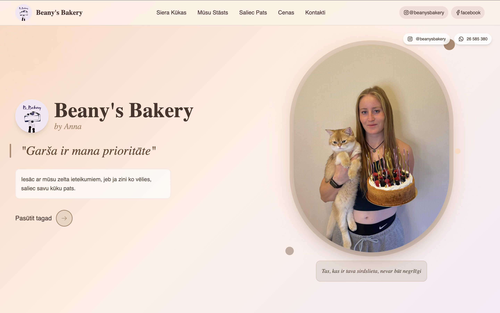
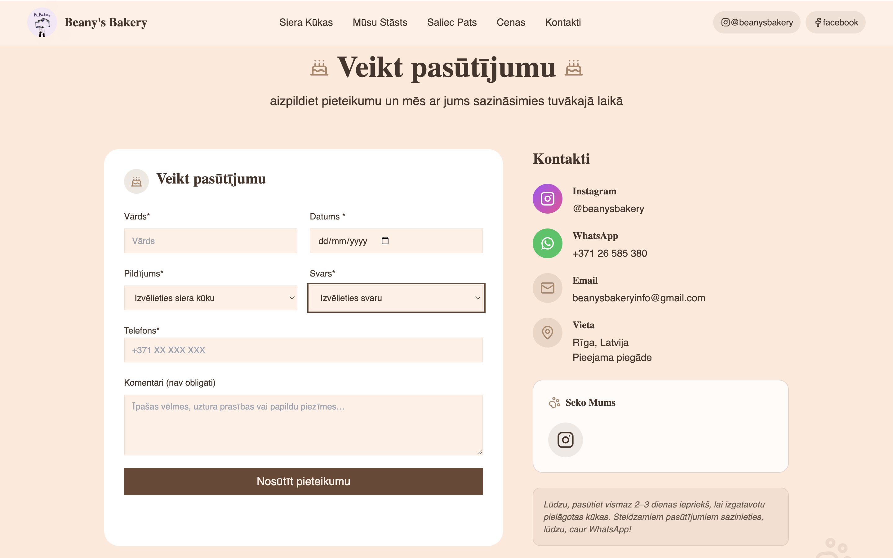

# Beany's Bakery — Landing Page & Order System

A modern landing page for a home-based cheesecake bakery with integrated order management system. Built as a freelance project with dual notification channels (Telegram + Email).

**Live Site:** [beanysbakery](https://bbakery-cheesecakes.netlify.app/)

## 📝 Note

This is a commercial project for a real client. The repository is private to protect business logic and client confidentiality. Code samples and detailed architecture can be shared upon request during interviews.

---

## 📸 Screenshots





#### Mobile View


---

## 🎯 Overview

Freelance project for a local bakery in Riga, Latvia. The client needed a professional web presence with a simple ordering system that sends real-time notifications to their Telegram and email.

---

## ✨ Key Features

- Single-page responsive design with smooth scrolling
- Interactive Cake Builder — step-by-step custom cake configuration
- Pre-made cake order form with quick selections
- **Netlify Functions** for serverless order processing
- **Dual notification system:** Telegram Bot API + Formspree email
- Automatic fallback if one channel fails
- WhatsApp and Instagram integration
- Toast notifications for user feedback
- Responsive grid layouts
- Accessible form components

---

## 🛠 Tech Stack

**Frontend**
- React + Vite
- Tailwind CSS
- Lucide React (icons)
- Notistack (notifications)

**Backend & Deployment**
- Netlify Functions (serverless)
- Telegram Bot API
- Formspree (email service)
- Deployed on Netlify

---

## 🏗 Architecture

┌─────────────────┐
│   React App     │
│   (Netlify)     │
└────────┬────────┘
         │
         │ POST /api/sendOrders
         | POST /api/sendCakeBuilderOrders
         ▼
┌─────────────────────┐
│ Netlify Function    │
│  (Serverless)       │
└──────┬──────┬───────┘
       │      │
       │      └──────► Formspree API
       │                  │
       │                  ▼
       │              📧 Email
       │
       └──────────► Telegram Bot API
                        │
                        ▼
                    💬 Telegram Chat

**Two Order Types:**
1. **Quick Order:** Pre-made cakes with dropdown selections
2. **Cake Builder:** Interactive 5-step custom cake configurator
   - Size selection with pricing
   - Base options (cookies, brownie, etc.)
   - Sweet layer filling
   - Additional filling (conditional based on selection)
   - Top layer options
   - Multiple toppings (checkboxes)
   - Optional decoration photo upload

**Order Flow:**
1. Frontend validates form data
2. POST request to Netlify Function
3. Function sends parallel requests to Telegram and Formspree
4. If one fails, other ensures delivery
5. Customer receives confirmation toast

---

## 🔧 Netlify Function Highlights

### Quick Order Endpoint
**Endpoint:** `/.netlify/functions/sendOrders`

**Request Example:**
```json
{
  "name": "Anna",
  "date": "2024-12-30",
  "cakeType": "Strawberry Cheesecake",
  "weight": "1.5kg",
  "phone": "+371 26585380",
  "comments": "Extra berries"
}
```

**Response:**
```json
{
  "success": true,
  "telegram": true,
  "email": true
}
```

---

### Custom Cake Builder Endpoint
**Endpoint:** `/.netlify/functions/sendCakeBuilderOrders`

**Request Example:**
```json
{
  "size": "1.5kg",
  "base": "Brownie",
  "baseFilling": "Piena šokolāde",
  "addionalBaseFilling": "Avenes",
  "topFilling": "Saldā karamele",
  "toppings": ["Fresh berries", "Chocolate chips"],
  "name": "Anna",
  "phone": "+371 26585380",
  "notes": "Birthday cake, please add candles",
  "decorationPhoto": null
}
```

**Response:**
```json
{
  "success": true,
  "telegram": true,
  "email": true
}
```


---

## 💡 Technical Decisions

**Why Netlify Functions?**
- No separate backend server needed
- Automatic scaling
- Free tier sufficient
- Environment variable security

**Why Dual Notification System?**
- Redundancy ensures no lost orders
- Client prefers Telegram for instant alerts
- Email backup for reliability and history

---

## 🎓 Skills Demonstrated

- Serverless architecture (Netlify Functions)
- API integration (Telegram Bot API, Formspree)
- Error handling and fallback strategies
- Form validation and user feedback
- Responsive design with Tailwind CSS
- Client communication and requirements gathering
- Production deployment

---


## 📧 Contact

Freelance project for Beany's Bakery, Riga, Latvia

**Developer:** Anete Asafreja
**GitHub:** [Portfolio](https://github.com/aasafreja/web-portfolio)
**LinkedIn:** [Anete Asafreja](https://www.linkedin.com/in/anete-asafreja-a03231138/)


---

## 📄 License

Proprietary - Built for Beany's Bakery
